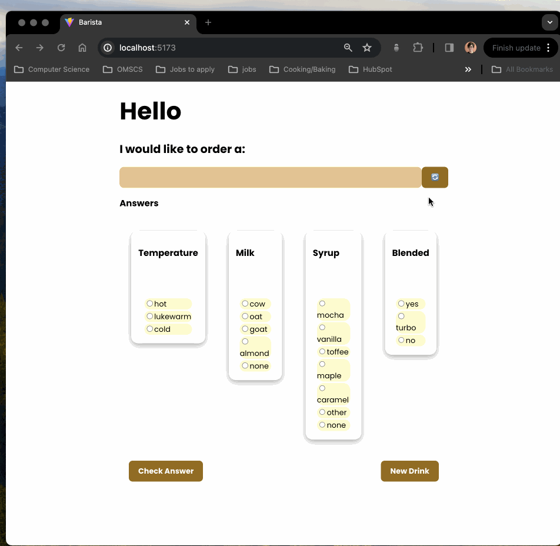

# Web Development Project  - Barista

This web app: **is inspired by Wordle. You can memorize coffee drink recipes and quiz yourself on a random real (and possibly discontinued 😉) Starbucks drink's ☕️ temperature , flavor, milk type, and blendedness. The app will let you know if you're a natural at barista-ing.**

## Features

The following **required** functionality is completed:

- [x] **XXX**
- [x] **XXX**

## Technologies Used
**React**: The frontend of the application is built using React, a popular JavaScript library for building user interfaces.
**JavaScript**: The app's logic and interactivity are powered by JavaScript, making it dynamic and responsive.
**HTML/CSS**: The structure and styling of the application are implemented using HTML and CSS for a polished user experience.

## Getting Started
To run the application locally, follow these steps:

Clone this repository to your local machine.

Navigate to the project directory in your terminal.

Install the necessary dependencies by running `npm install`.

Start the development server by running `npm start`.

Open your web browser and navigate to http://localhost:3000 to view the application.

## Video Walkthrough

Here's a walkthrough of implemented required features:

 

<!-- Replace this with whatever GIF tool you used! -->
GIF created with LICEcap.  
<!-- Recommended tools:
[Kap](https://getkap.co/) for macOS
[ScreenToGif](https://www.screentogif.com/) for Windows
[peek](https://github.com/phw/peek) for Linux. -->

## Notes

XXXX

## License

    Copyright [2024] [Faye Alangi]

    Licensed under the Apache License, Version 2.0 (the "License");
    you may not use this file except in compliance with the License.
    You may obtain a copy of the License at

        http://www.apache.org/licenses/LICENSE-2.0

    Unless required by applicable law or agreed to in writing, software
    distributed under the License is distributed on an "AS IS" BASIS,
    WITHOUT WARRANTIES OR CONDITIONS OF ANY KIND, either express or implied.
    See the License for the specific language governing permissions and
    limitations under the License.
